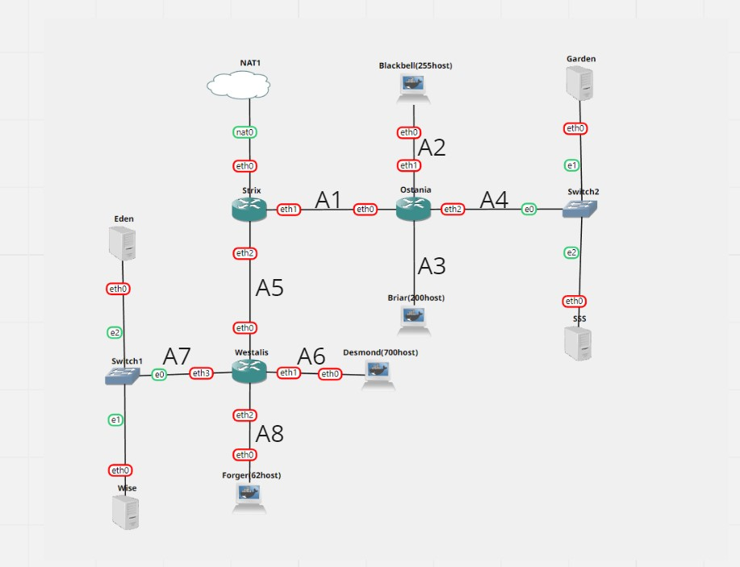
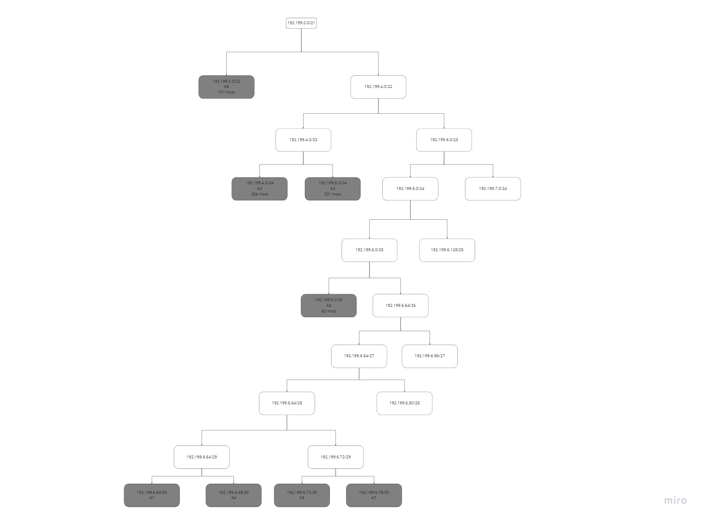

# Jarkom-Modul5-E14-2022

| Nama                   | NRP        |
| ---------------------- | ---------- |
| Dhafin Almas Nusantara | 5025201064 |

## Topologi



## VLSM

| Node  | Alokasi | Netmask | IP           |
| ----- | ------- | ------- | ------------ |
| A1    | 2       | /30     | 192.199.6.64 |
| A2    | 256     | /24     | 192.199.4.0  |
| A3    | 201     | /24     | 192.199.5.0  |
| A4    | 3       | /30     | 192.199.6.68 |
| A5    | 2       | /30     | 192.199.6.72 |
| A6    | 701     | /22     | 192.199.0.0  |
| A7    | 3       | /30     | 192.199.6.76 |
| A8    | 63      | /26     | 192.199.6.0  |
| Total | 1231    | /21     |

## Pohon VLSM



## Config IP pada GNS3

- Strix

```
auto eth0
iface eth0 inet dhcp

auto eth1
iface eth1 inet static
address 192.199.6.65
netmask 255.255.255.252

auto eth2
iface eth2 inet static
address 192.199.6.73
netmask 255.255.255.252
```

- Westalis

```
auto eth0
iface eth0 inet static
address 192.199.6.74
netmask 255.255.255.252
gateway 192.199.6.73

auto eth1
iface eth1 inet static
address 192.199.0.1
netmask 255.255.252.0

auto eth2
iface eth2 inet static
address 192.199.6.1
netmask 255.255.255.192

auto eth3
iface eth3 inet static
address 192.199.6.77
netmask 255.255.255.252
```

- Wise

```
auto eth0
iface eth0 inet static
address 192.199.6.78
netmask 255.255.255.252
gateaway 192.199.6.77
```

- Eden

```
auto eth0
iface eth0 inet static
address 192.199.6.79
netmask 255.255.255.252
gateaway 192.199.6.77
```

- Forger

```
auto eth0
iface eth0 inet static
address 192.199.6.2
netmask 255.255.255.192
gateaway 192.199.6.1
```

- Desmond

```
auto eth1
iface eth1 inet static
address 192.199.0.2
netmask 255.255.252.0
gateaway 192.199.0.1

```

- Ostania

```
auto eth0
iface eth0 inet static
address 192.199.6.66
netmask 255.255.255.252
gateway 192.199.6.65

auto eth1
iface eth1 inet static
address 192.199.4.1
netmask 255.255.255.0

auto eth2
iface eth2 inet static
address 192.199.6.69
netmask 255.255.255.252

auto eth3
iface eth3 inet static
address 192.199.5.1
netmask 255.255.255.0
```

- Blackbell

```
auto eth0
iface eth0 inet static
address 192.199.4.2
netmask 255.255.255.0
gateway 192.199.4.1
```

- Briar

```
auto eth0
iface eth0 inet static
address 192.199.5.2
netmask 255.255.255.0
gateway 192.199.5.1
```

- Garden

```
auto eth0
iface eth0 inet static
address 192.199.6.70
netmask 255.255.255.252
gateway 192.199.5.69
```

- SSS

```
auto eth0
iface eth0 inet static
address 192.199.6.71
netmask 255.255.255.252
gateway 192.199.5.69
```

## Config Routing

- Strix

```

```
