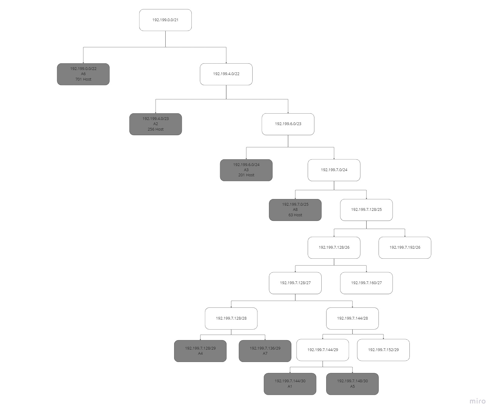

# Jarkom-Modul5-E14-2022

| Nama                   | NRP        | prefix  |
| ---------------------- | ---------- | ------- |
| Dhafin Almas Nusantara | 5025201064 | 192.199 |

## Topologi


## VLSM

| Node  | Alokasi | Netmask | IP            |
| ----- | ------- | ------- | ------------- |
| A1    | 2       | /30     | 192.199.7.144 |
| A2    | 256     | /23     | 192.199.4.0   |
| A3    | 201     | /24     | 192.199.6.0   |
| A4    | 3       | /29     | 192.199.7.128 |
| A5    | 2       | /30     | 192.199.7.148 |
| A6    | 701     | /22     | 192.199.0.0   |
| A7    | 3       | /29     | 192.199.7.136 |
| A8    | 63      | /25     | 192.199.7.0   |
| Total | 1231    | /21     |

## Pohon VLSM



## Config IP pada GNS3

- Strix

```
auto eth0
iface eth0 inet dhcp

auto eth1
iface eth1 inet static
address 192.199.7.145
netmask 255.255.255.252

auto eth2
iface eth2 inet static
address 192.199.7.149
netmask 255.255.255.252
```

- Westalis

```
auto eth0
iface eth0 inet static
address 192.199.7.150
netmask 255.255.255.252
gateway 192.199.7.149

auto eth1
iface eth1 inet static
address 192.199.0.1
netmask 255.255.252.0

auto eth2
iface eth2 inet static
address 192.199.7.1
netmask 255.255.255.128

auto eth3
iface eth3 inet static
address 192.199.7.137
netmask 255.255.255.248
```

- Wise

```
auto eth0
iface eth0 inet static
address 192.199.7.138
netmask 255.255.255.248
gateaway 192.199.7.137
```

- Eden

```
auto eth0
iface eth0 inet static
address 192.199.7.139
netmask 255.255.255.248
gateaway 192.199.7.137
```

- Forger

```
auto eth0
iface eth0 inet static
address 192.199.7.2
netmask 255.255.255.128
gateaway 192.199.7.1
```

- Desmond

```
auto eth1
iface eth1 inet static
address 192.199.0.2
netmask 255.255.252.0
gateaway 192.199.0.1

```

- Ostania

```
auto eth0
iface eth0 inet static
address 192.199.7.146
netmask 255.255.255.252
gateway 192.199.7.146

auto eth1
iface eth1 inet static
address 192.199.4.1
netmask 255.255.254.0

auto eth2
iface eth2 inet static
address 192.199.7.129
netmask 255.255.255.248

auto eth3
iface eth3 inet static
address 192.199.6.1
netmask 255.255.255.0
```

- Blackbell

```
auto eth0
iface eth0 inet static
address 192.199.4.2
netmask 255.255.254.0
gateway 192.199.4.1
```

- Briar

```
auto eth0
iface eth0 inet static
address 192.199.6.2
netmask 255.255.255.0
gateway 192.199.6.1
```

- Garden

```
auto eth0
iface eth0 inet static
address 192.199.7.130
netmask 255.255.255.248
gateway 192.199.7.129
```

- SSS

```
auto eth0
iface eth0 inet static
address 192.199.7.131
netmask 255.255.255.248
gateway 192.199.7.129
```

## Config Routing

- Strix

```

```
